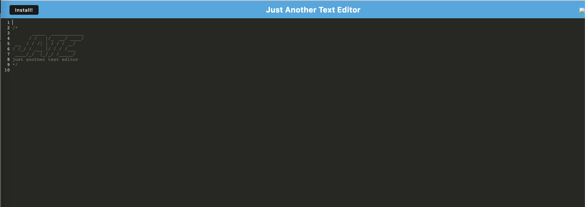
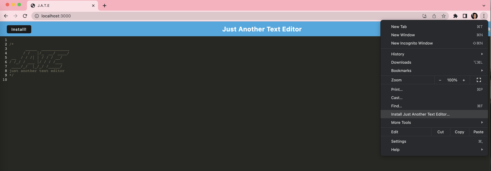
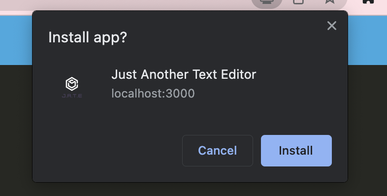
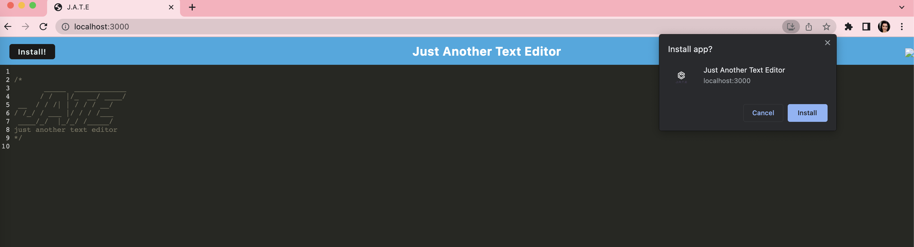
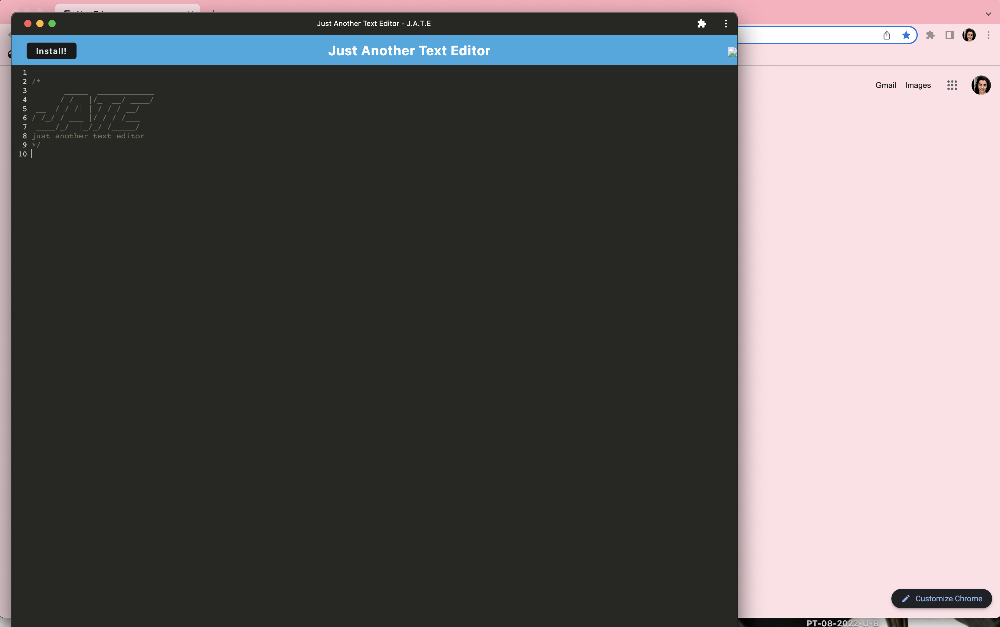

# J.A.T.E

## Description 

This Progressive Web Application (PWA) is a single page application text editor that runs in the browser and offline. This PWA also uses several data persistance techniques to serve in case the browser does not support one of the options. 

## Table of Contents 

[Usage](#usage) 
[Road Map](#road-map) 
[License](#license)

## Usage 

This application uses <a href="https://webpack.js.org">webpack</a>, the <a href="https://webpack.js.org/plugins/html-webpack-plugin/">HTMLWebpackPlugin</a>, IndexedDB and <a href="https://www.npmjs.com/package/idb">idb</a>. In order to use the app offline, we will use <a href="https://developer.chrome.com/docs/workbox/">workbox</a>. 

In order to run the application, the user will type 

> npm start 

into the terminal.  

From there, the user will type the following into the chrome browser to access the application online: 

> localhost:3000

Once the application is open online, where will be an install button on the top left corner. The user can press that button to install the application and use it offline. 

The user can also install the application through chrome browser by clicking the meatball menu, selecting install J.A.T.E, and following the pop-up prompt. The application should then automatically open. 

## Road Map 

Future iterations of this application will include a working install button. 

## License 

[MIT](https://choosealicense.com/licenses/mit/)

